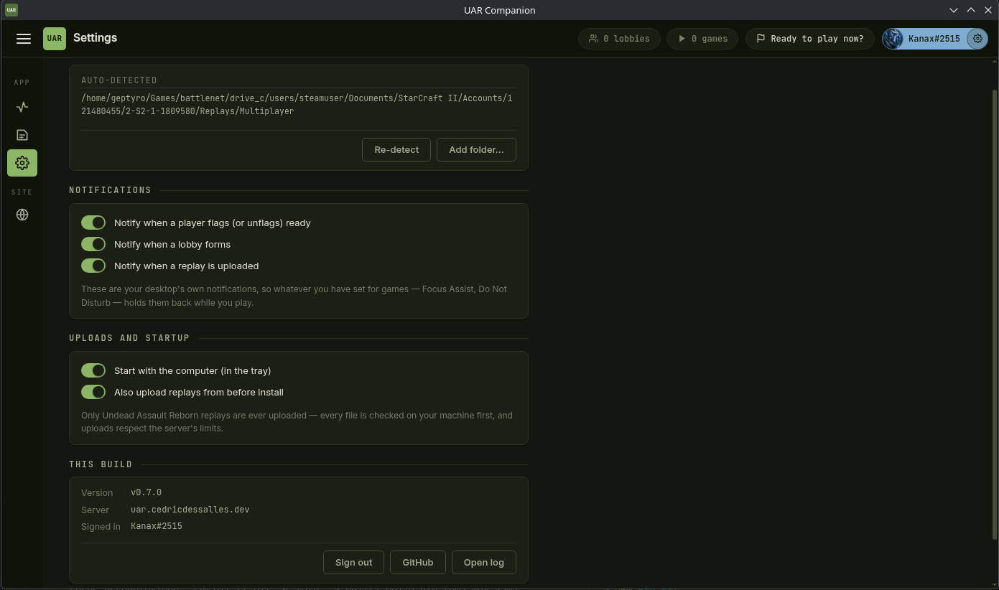

# UAR Companion

[](https://github.com/Geptyro/uar-companion/actions/workflows/ci.yml)
[](https://github.com/Geptyro/uar-companion/releases/latest)
[](LICENSE)

Companion app for **[Undead Assault Reborn](https://uar.cedricdessalles.dev)**
(StarCraft II arcade, EU). It sits in your system tray and:

- **auto-uploads your UAR replays** to [uar.cedricdessalles.dev](https://uar.cedricdessalles.dev),
  so your profile, XP history and the leaderboards stay up to date — no manual
  uploads after every game;
- **shows who is "ready to play"** right in the tray, with an optional
  notification when someone flags themselves on the website;
- **tells you when a lobby forms**, so you can join while it is filling
  instead of finding out after the game started. Off with one toggle in
  Settings if you would rather not be interrupted; it stays quiet for
  lobbies you are already in.



## Install

Grab the latest build from the
[releases page](https://github.com/Geptyro/uar-companion/releases/latest):

| OS | File | Notes |
| --- | --- | --- |
| Windows | `UAR-Companion-Setup-<version>.exe` | one-click installer; SmartScreen may warn (unsigned) — “More info → Run anyway” |
| Linux | `UAR-Companion.AppImage` | make it executable, then run (see below) |
| macOS | `UAR-Companion-<version>-mac.zip` | unzip, right-click → Open the first time (unsigned) |

Windows and Linux builds update themselves; macOS has to be replaced by hand,
because Squirrel.Mac will not auto-update an unsigned app.

**Linux notes:** your browser's "Open" button cannot launch the AppImage —
KDE/GNOME block running executables from that context, and downloads never
have the executable bit anyway. Save the file, then either
`chmod +x UAR-Companion-*.AppImage && ./UAR-Companion-*.AppImage` or right-click →
Properties → Permissions → "Is executable" in your file manager. AppImages
also need FUSE: on Arch-based distros `sudo pacman -S fuse2` (or run with
`--appimage-extract-and-run` instead).

On first launch the app finds your `Replays/Multiplayer` folder by itself
(Windows, macOS, and Lutris / Wine / Steam Proton layouts on Linux). If yours
is somewhere unusual, add it under **Watched folders**. Turn on **Start with
the computer** in the settings and forget about it.

## Verifying a download

Installers are published with a build provenance attestation, so you can check
that a file really came from this repository's release pipeline and not from
someone who reuploaded it elsewhere:

```bash
gh attestation verify UAR-Companion-Setup-<version>.exe --repo Geptyro/uar-companion
```

Attestations start with the first release built after v0.8.0; earlier
downloads have nothing to verify against.

The builds are not code-signed yet, which is why Windows and macOS still warn
on first run. Until they are, the attestation is the stronger check of the two:
it names the commit and the workflow run the binary was built from.

## What it uploads (and what it doesn't)

Every new replay is checked **on your machine** first: only files whose map
title is *Undead Assault reborn* are ever sent, everything else is ignored.
A hash pre-check skips replays the server already knows, and uploads are
spaced out to respect the server's rate limits (a large backlog simply takes
a few hours to trickle in — 409 "already ingested" answers are normal when a
teammate's recording of the same game got there first).

Lobby and game status is reported only while you are signed in, and says only
whether you are in a lobby or in a game — it never reads anything else from
StarCraft II. Sign out in the app and it stops immediately.

Replays contain the same save-data every player in the lobby already
broadcasts in-game; the website uses it for the public player profiles.

## Development

```bash
npm install
cp .env.example .env  # dev overrides: local website + separate app data
npm run dev        # electron-vite dev with hot reload
npm test           # unit tests (node:test over the core modules)
npm run e2e        # full-stack test against a local uar-website + docker rig
npm run dist:linux # package an AppImage (dist:win / dist:mac likewise)
```

The core logic (MPQ title sniff, upload queue, folder discovery) lives in
`src/core/` as plain dependency-light TypeScript — `src/cli.ts` runs it
headless without Electron. `src/core/mpq.ts` is vendored from the website's
TS port of [mpyq](https://github.com/arkx/mpyq) (MIT, Aku Kotkavuo).

How the app decides StarCraft II is running is written up in
[`docs/sc2-detection.md`](docs/sc2-detection.md).

Every user-visible change needs a `changelog/unreleased/*.md` entry in the same
commit; see [`CLAUDE.md`](CLAUDE.md) and `changelog/unreleased/README.md`.

## Releases

`npm run release vX.Y.Z` rolls up the unreleased changelog entries, bumps the
version, commits, tags and pushes. The tag is what triggers
[`release.yml`](.github/workflows/release.yml): all three platforms are built
on GitHub-hosted runners, attested, and attached to a GitHub release.

The pipeline is deliberately locked down, because a release here auto-updates
every installed copy:

- Actions are pinned to commit SHAs rather than moving tags like `@v4`.
- The workflow is `contents: read` by default; only the publishing job
  escalates, and only to what it needs.
- A repository ruleset keeps `v*` tags immutable, so a published tag cannot be
  quietly repointed at different code.

## License

[MIT](LICENSE) © Cédric Dessalles
